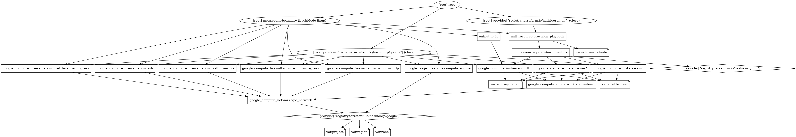

# Ansible homework

## first exercise

Create three VMs in GCP

One VM with an http load balancer that distributes traffic between the next two machines (you can choose what software to use for load balancing). DON'T USE GCP Load balancers. This machine will have to have public IP.
One LINUX VM serving a static webpage which says "This is machine ${hostname} running ${os version}
One Windows VM serving a static webpage which says "This is machine ${hostname} running ${os version}
The load balancer should distribute the load round-robin between the Linux and the Windows VM, so that when accesing its IP, every reload should randomly return the webpage of one or another node.
Goals of the excercise

Manage Linux and Windows VMs with Ansible
Use Ansible facts and templates to generate and copy the static .html files to each of the servers
Use Ansible to configure a Reverse Proxy (Apache HTTP Server, Nginx, whatever you prefer...)

If you know how to do it already, use Ansible from within terraform as a provisioner. If not, you can have different code for terrafor and ansible

## Steps Done

* Created 2 linux VMs to serve static files
* Created 1 linux VM to load balance
* Ansible run as a local provisioner
* Generate html file with a template using facts
* Nginx does round-robin load balancing

## Task part Two

* Made a python script which outputs fortune
* in playbook, copy script into Apache2 cgi-bin directory
* enable cgi module for apache2
* changed load balancer conf so it redirects to the script url

## Terraform graph

